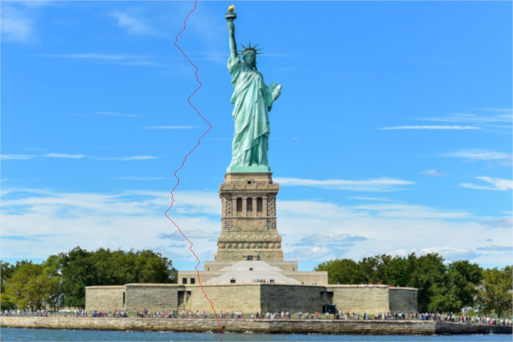
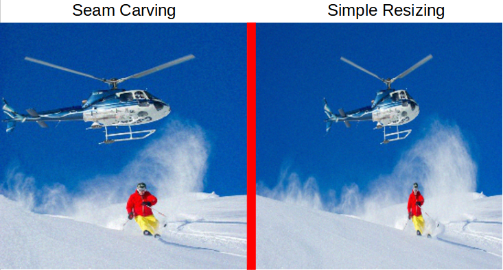
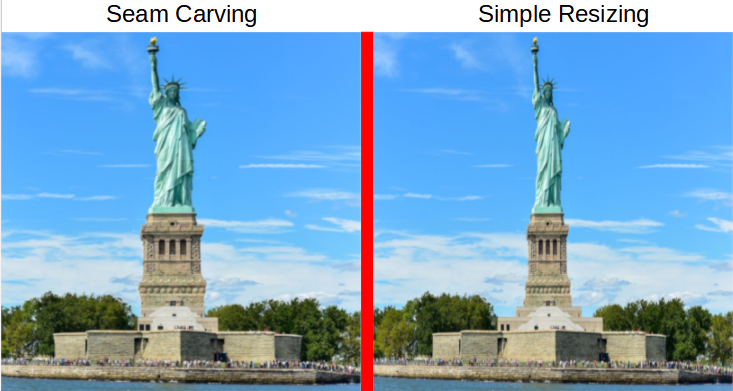

# Content aware image resizing (seam carving)
Ordinarily when a image is resized each pixel is treated equally, meaning everthing gets reduced or increased by the same amount. This leads to weird distortions to the subject of the image.
In 2007 a paper titled “Seam Carving for Content-Aware Image Resizing” was published, which suggested resizing along seams of low energy. A vertical seam is defined in this case as one pixel per row and each pixel being 8-connected (pixels in adjacent rows differ by at most one column).

## Original images

## Examples of seams

## Final side by side comparison

